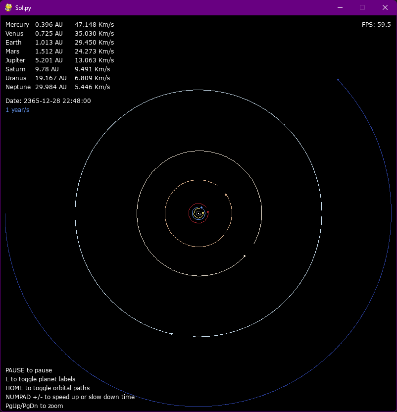
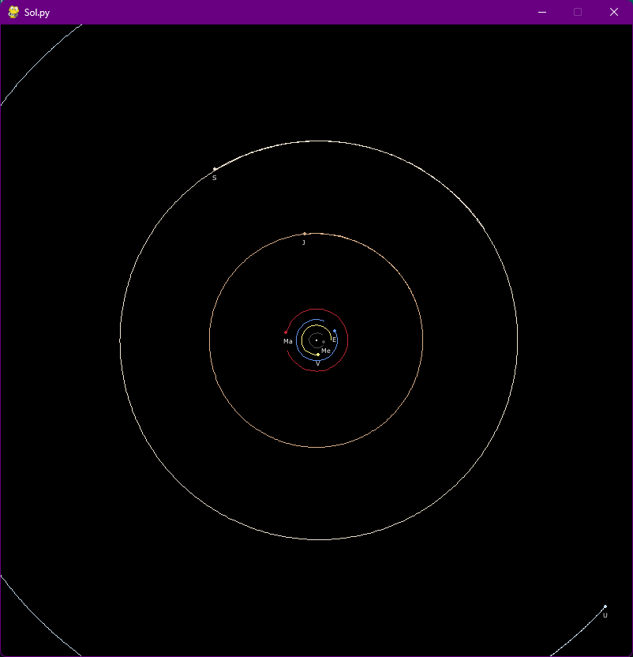
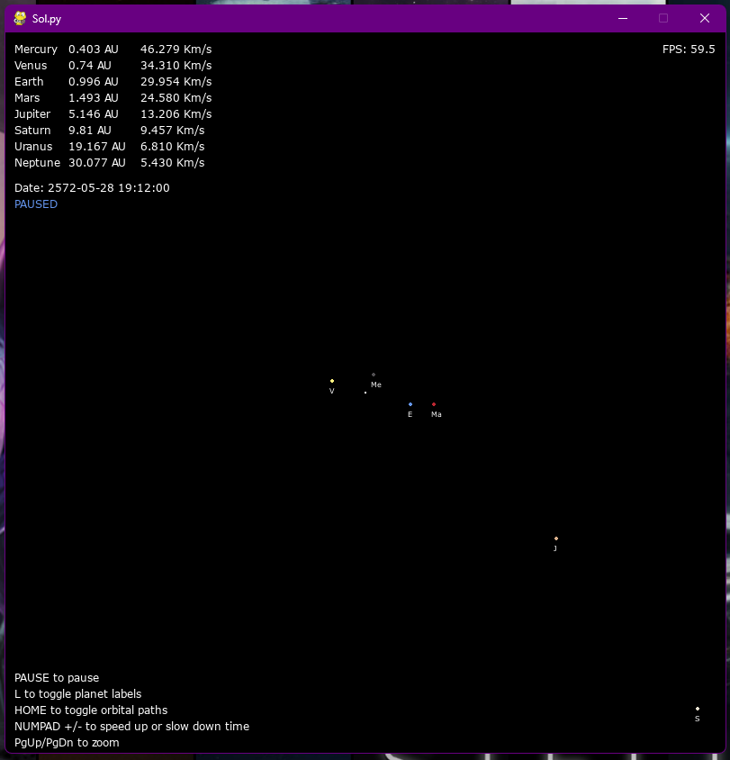

# Sol.py

An example of a planetary physics simulation using pygame

### Controls:

- HOME to toggle orbital paths
- L to toggle planet labels
- NUMPAD +/- to speed up or slow down time
- PgUp/PgDn to zoom
- PAUSE to pause the simulation

---

  
   
  

Based on this tutorial by Tech With Tim:
https://www.youtube.com/watch?v=WTLPmUHTPqo
